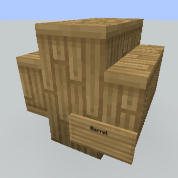
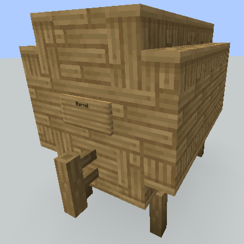

本服务器添加了酿酒玩法，玩家可自由探索配方并酿出酒，每种酒饮用又各有自己的效果。

## 发酵
将炼药锅放在火或者其他热源上方装满水，通过右键添加原料，等待原料发酵几分钟用玻璃瓶装起来即可.

::: tip
如果你想知道原料已经发酵的时间，可以手持时钟右击炼药锅。
:::

## 蒸馏

把发酵好的药水放进酿造台里，再把荧石粉放在上方即可（不会被消耗）。

::: tip
有些配方不需要蒸馏。
:::

## 贮存
你可以用桶来贮存酒。

### 原版桶：6 个槽位
游戏里的原版木桶可以用来贮存少量饮品。把桶放下来，往里面放入需要贮存的饮品即可。

---
你也可以造更大的桶.

### 小桶：9 个槽位
用8个木楼梯搭建成桶的形状，在右下方放一个告示牌并在第一行写上`Barrel`即可。

如果成功，会有桶建造成功的提示。

### 大桶：27 个槽位
用5个栅栏、16个木楼梯和18个木板搭建成桶的形状。 放上一个木龙头（栅栏），在上方放一个告示牌并在第一行写上`Barrel`即可。

如果成功，会有桶建造成功的提示。在大桶建造成功后，你就可以拆掉告示牌了。

右键点击桶即可打开界面，将饮品放进桶里即可贮存。每经过一个游戏日，饮品就会贮存一年。根据配方的不同，使用不同木头制作的桶可能会对饮品的品质造成影响。

::: tip
原版桶为橡木桶。
:::

## 饮用
饮用时，饮品中的酒精会计入玩家。根据饮品质量的差异，可能产生不同效果。你可能会无法正常行走，路线会扭曲，产生失明、反胃、中毒等效果。输入的文字内容的内容会随醉酒情况改变（聊天或告示牌等），如果酒精特别强，可能产生毒性作用，喝了太多之后有可能会呕吐或退出游戏，玩家在此后的短时间内可能无法进入游戏。过度饮酒后，玩家可能会晕倒（断开连接）。

## 饮品密封（售卖饮品）
你可以把你酿造的饮品提供给其他玩家，他们可以放进桶里继续贮存。如果你希望在[商店](/main/shop.md)出售饮品则需要将饮品用密封。你需要在密封桌上进行密封。密封桌需要2个瓶子和4个木板，把饮品放入密封桌即可。密封的饮品不能继续贮存或进一步加工。

## 醒酒
醉酒之后需要等一段时间才能完全清醒。在这段时间里，酒精含量会持续下降。如果你在严重喝醉的时候下线，重新上线之后可能会发现自己在荒野中一个完全未知的地方。但如果你在几小时后或第二天登录，会发现你回到了设置好的家中。同样，如果饮品质量不算最好，你可能会遇到不好的宿醉类型（缓慢和饥饿效果）。

