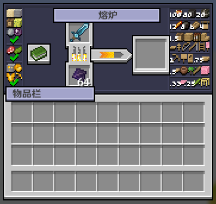

本服务器添加了强化玩法，玩家可使用精锻矿对装备进行强化。

## 获取
炉岩碳可通过挖矿、钓鱼或击杀怪物获得。

挖矿挖掘越稀有的矿物获得的碳越多，钓鱼、击杀任意怪物都有几率获得。

## 强化
将炉岩碳与要强化的装备一起放入熔炉，即可进行强化。

::: tip
可强化的装备有：盔甲、斧、弓、盾牌、剑、三叉戟和弩。
:::

任何装备在强化时都有可能强化失败，装备的等级越低强化成功概率越低。强化失败之后装备会损坏，等级越高的装备损坏的等级越大，十级以上的装备在强化失败后会直接损坏。

## 保护券
保护券可以保护装备在强化失败时免受一次损坏。保护券可通过抽奖、在系统商店购买或是参与活动获得。

::: details 所有保护券
| 名称           | 使用效果                                                                                                           | 获取方法 |
| -------------- | ------------------------------------------------------------------------------------------------------------------ | -------- |
| 高级强化保护券 | 持有该保护券，强化十级以上失败时，装备不会被销毁。只有强化失败时，保护券才会消失，强化失败时，装备的强化保持不变。 |          |
| 强化保护符     | 持有该保护券，强化失败时，装备不会被掉级。只有强化失败时,保护券才会使用，强化失败时,装备的强化保持不变。           |          |
| 祝圣精华       | 使用后,可以提升强化成功率，效果持续30分钟。                                                                        |          |
:::
