## 什么是Slimefun？

#### Slimefun又名粘液科技 是一个 Bukkit 插件，以向服务器提供模组级体验为目标。

### Slimefun它能做什么

#### 在不安装任何MOD（模组）的情况下 Slimefun 可以为玩家提供更加多元化且丰富的玩法，其中涉及的领域包括但不限于 科技 魔法 附魔等

# 游玩

## 入门

Slimefun（以下统称粘液科技）入门需要消耗大量经验值来解锁对应的科技具体详见：粘液科技指南

粘液科技指南可以在`游戏主城`内花费`五十元`游戏币购买

## 壹·基础机器介绍

### I-增强型工作台

增强型工作台将会是你入门粘液科技的第一个基础机器，他不需要任何电力，增强型工作台将被用于合成任何有关粘液科技的物品。

### 建造

大多数基础机器都需要按照特定的方式摆放出来，增强型工作台需要的材料为一个发射器和一个普通得工作台

摆放方式为将发射器置于工作台下方，一个完整的增强型工作台看起来如下

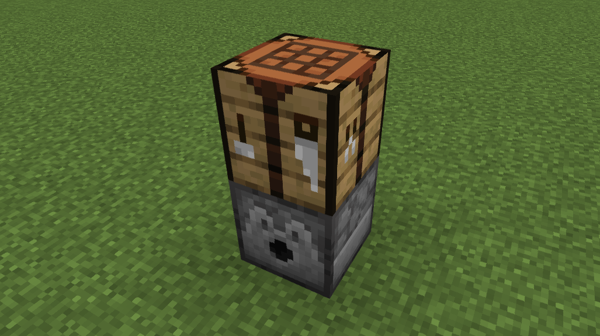

### 使用方式

将需要进行合成的物品按照合成表摆放于发射器内，然后右击合成台即可

### II-磨石

磨石是粘液科技入门的基础机器之一，它可以用来分解各种原料以获得其他所需的材料

### 建造

磨石所需的材料为一个任意材质的木栅栏以及一个发射器

摆放方式为在木栅栏下放置一个发射口朝上的发射器

注意：如使用绯红木栅栏与诡异木栅栏可能会导致BUG，故不推荐使用这两种材质的木栅栏

一个正确的摆放方式如下图

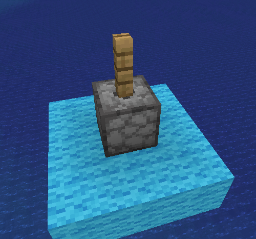

### 使用方式

将要分解的原料放置于发射器中，右击木栅栏即可

### 可被分解的原料及配方

| 原料  | 产物  |   |
| -- | --- | --- |
| 1烈焰棒 | 4烈焰粉  |   |
| 1骨头 | 4骨粉  |   |
| 1骨块 | 9骨粉  |   |
| 1原石 | 1沙砾  |   |
| 1安山岩 | 1沙砾  |   |
| 1闪长岩 | 1沙砾  |   |
| 1花岗岩 | 1沙砾  |   |
| 1泥土 | 1石块  |   |
| 1砂岩 | 1沙子  |   |
| 1红砂岩 | 4红沙  |   |
| 1海晶石砖 | 2海晶石  |   |
| 1下界疣块 | 9下界疣  |   |
| 1石英块 | 4石英  |   |
| 1紫水晶 | 4紫水晶碎片  |   |
| 1魔法结晶-II | 4魔法结晶-I  |   |
| 1魔法结晶-III | 4魔法结晶-II  |   |
| 1末影结晶-II | 4末影结晶-I  |   |
| 1末影结晶-III | 4末影结晶-II  |   |
| 1钻石 | 4碳  |   |
| 1下界疣 | 2魔法结晶-I  |   |
| 1末影之眼 | 2末影结晶-I  |   |
| 1小麦 | 1小麦粉  |   |
|

### III-盔甲锻造台

盔甲锻造台是粘液科技得基础机器之一，借由它可以锻造各种各样的粘液科技新增防具包括魔法防具

### 建造

盔甲锻造台所需的材料为一个发射器和一个完好的铁砧

将完好的铁砧放置于发射口朝上的发射器上方即可

注意：所使用的铁砧必须是完整的，无法使用`轻微损坏的铁砧`以及`严重损坏的铁砧`替代

一个正确的摆放方式如下图

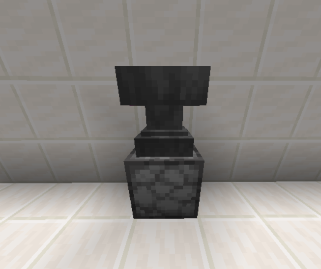

### 使用方式

将材料按照合成表放入发射器中后，右击铁砧即可

### IV-矿石粉碎机

粘液科技非常重要的基础机器之一，用于粉碎原料以获取各种基础材料

### 建造

矿石粉碎机是一个多方块结构，组成他所需要的材料有一个发射器、一个下界砖栅栏与两个铁栏杆

将下界砖栅栏放置于发射口朝向上方的发射器上并将铁栏杆置于发射器两侧

一个正确的摆放方式如下图

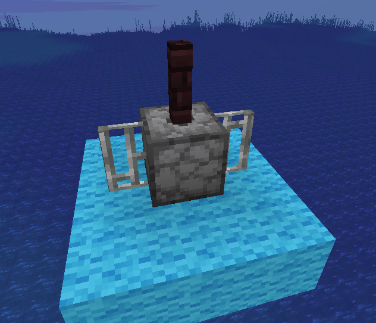

### 使用方式

将需要被粉碎的原料放入发射器中后，右击下界砖栅栏即可

### 可以被粉碎的原料及配方

| 原料 | 产物  |   |
| --- | --- | --- |
| 1金锭（4K） | 1金粉  |   |
| 1金锭（6K）|  2金粉 |   |
| 1金锭（8K） |  2金粉 |   |
| 1金锭（10K） |  3金粉 |   |
| 1金锭（12K） | 3金粉  |   |
| 1金锭（14K） |  4金粉 |   |
| 1金锭（16K） |  4金粉 |   |
| 1金锭（18K） |  5金粉 |   |
| 1金锭（20K） |  5金粉 |   |
| 1金锭（22K） |  6金粉 |   |
| 1金锭（24K） |  6金粉 |   |
| 1沙砾 | 1沙子  |   |
| 1岩浆块 | 1硫酸盐  |   |
| 1碳 | 8煤炭  |   |
| 1压缩碳 | 4碳  |   |
| 1粗铁 | 1铁粉  |   |
| 1粗铜 | 1铜粉  |   |
| 1粗金 | 1金粉  |   |
| 16下界岩 | 1硫酸盐  |   |
| 筛矿 | 1已粉碎的矿石  |   |
| 1已粉碎的矿石 | 1粉末状的矿石  |   |
| 1纯矿簇 | 1一小撮铀  |   |
| 1煤矿石 | 1煤炭  |   |
| 1青金石矿石 | 7青金石  |   |
| 1红石矿石 | 4红石粉  |   |
| 1钻石矿石 | 1钻石  |   |
| 1绿宝石矿石 | 1绿宝石  |   |
| 1下界石英矿石 | 1下界石英  |   |
| 1下界金矿石 | 1金粒  |   |
| 1镶金黑石 | 4金粒  |   |
| 1铁矿石 | 1铁粉  |   |
| 1铜矿石 | 1铜粉  |   |
| 1金矿石 | 1金粉  |   |
|

（注：以上所有的矿石包含其深层变种）

### V-压缩机

压缩机是粘液科技重要的基础机器之一，它被用于将原料压缩成所需的材料

### 建造

压缩机是一个多方块结构，组成他所需的材料有一个发射器、一个下界砖栅栏与两个活塞

将下界砖栅栏放置于发射口朝上的发射器上方后，将两个活塞头朝上的活塞分别放于发射器两侧

一个正确的摆放方式如下图

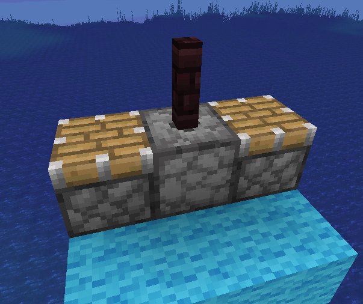

### 使用方法

将要压缩的原料放入发射器中，然后右击地狱砖栅栏，等待片刻即可

### 可以被压缩的原料及配方

|原料  | 产物  |   |
| -- | --- | --- |
| 4石块 | 1原石  |   |
| 8燧石 | 1原石  |   |
| 8煤碳块 | 9碳  |   |
| 4木炭 | 1煤炭  |   |
| 8煤炭 | 1碳  |   |
| 8钢锭 | 1钢板  |   |
| 4碳 | 1压缩碳  |   |
| 8强化合金锭 | 1钢筋板  |   |
|

### VI-简易冶炼炉

没什么卵用，此处跳过，待后续有空时补充

### VII-冶炼炉

粘液科技重要的基础机器之一，用于冶炼矿物及融合合金

### 建造

冶炼炉是一个多方块结构，构成它所需要的材料有一个发射器，两个下界石砖，一个下界石砖栅栏以及一个下界石

将下界石砖栅栏放置于发射口朝上的发射器上方，随后将下界石放置于发射器下方第二格与发射器间隔一格，并将下界石砖分别放置于发射器两侧

一个正确的摆放方式如下图

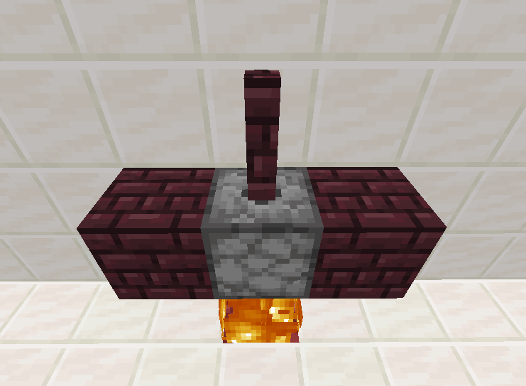

### 使用方式

确保你的下界石上有火焰，将材料按照合成表放入发射器后，右击下界石砖栅栏即可，具体合成表详见:粘液科技指南

### VIII-自动点火机

自动点火机石粘液科技的基础机器之一

### 使用方法

将自动点火机放置于冶炼炉发射器旁并往自动点火机里填充打火石即可

此处附图一张

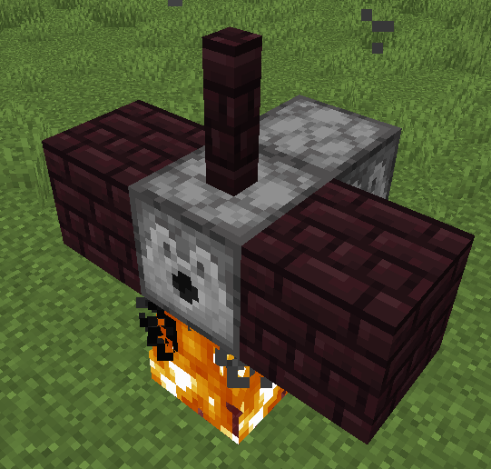

注意：自动点火机只能作为冶炼炉的扩展，不能用于简易冶炼炉

### X-压力仓

压力仓是粘液科技的基础机器之一，将原料放入然后获取产物

### 建造

压力仓是一个多方块结构，它由一个发射器，两个平滑石台阶，一块玻璃，一个炼药锅与四个活塞组成

将炼药锅置于玻璃下方后，将发射口朝下的发射器放置于玻璃上方并在发射器的两侧分别放上平滑石台阶，将四个活塞头朝上的活塞分别放置于炼药锅与玻璃两侧即可

一个正确的建造方式如下图

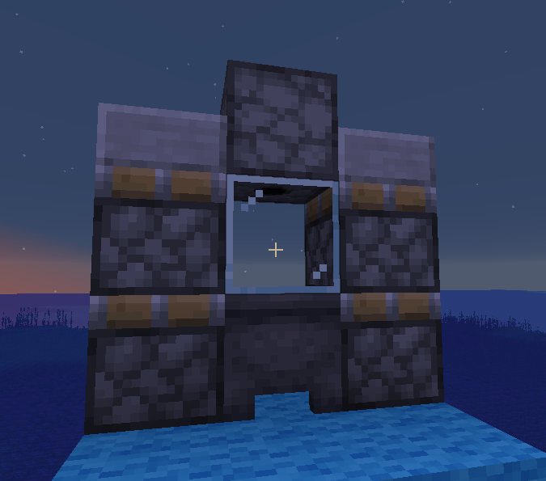

### 使用方式

将原材料按照合成表放入发射器内后，右击炼药锅等待片刻即可

### XI-魔法工作台

魔法工作台是粘液科技的基础机器之一，用于合成有关于魔法的物品

### 建造

魔法工作台是一个多方块结构，由一个书架、一个工作台和一个发射器并排放置

将工作台放置于中间，书架放置于工作台左侧，发射器则放置于工作台右侧

一个正确的摆放方式如下图

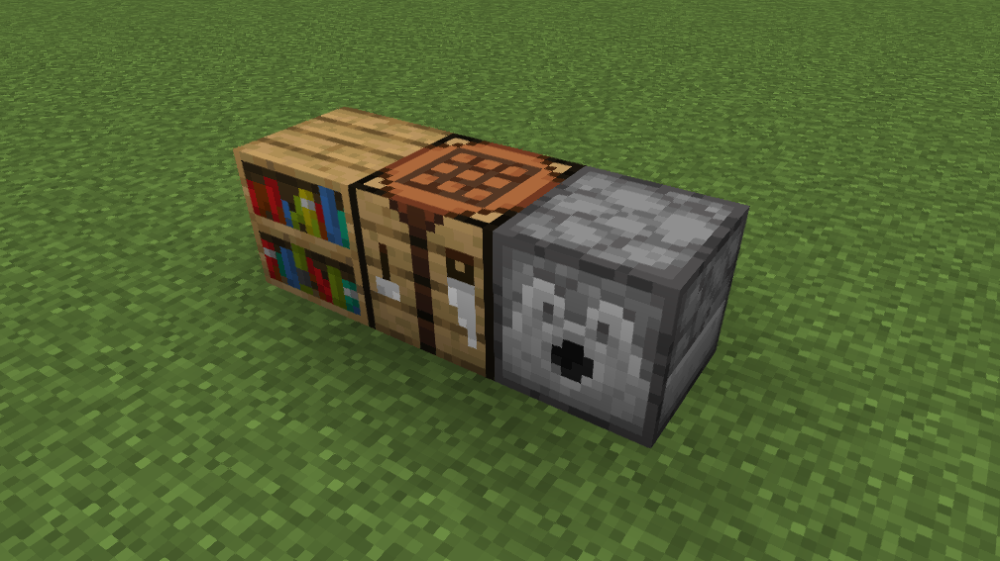

### 使用方式

将材料放按照合成表放置于发射器中后，右击工作台即可

### XII-洗矿机

洗矿机是粘液科技重要的基础机器之一，用于清洗筛矿使其变成矿粉

### 建造

洗矿机是一个多方块结构，它由一个发射器，一个木栅栏与一个炼药锅组成

将炼药锅放置于木栅栏下方后，将发射器放置于木栅栏上方即可

一个正确的建造方式如下图

注意：发射器无朝向要求，玩家可根据喜好摆放

### XIII-台锯

台锯是粘液科技的的基础机器之一，用于分解原木以获得更多的原木

它将原木转换为 8 个木板，而不是像原版工作台那样只能转换为 4 个

台锯也可以将 1 个木板转换为 4 个木棍

### 建造

台锯是多方块结构，需要的材料有两个平滑石台阶，一个切石机，一个铁方块

将平滑石台阶分别放置于切石机两侧，在切石机的下方放置铁方块即可

一个正确的建造方式如下图

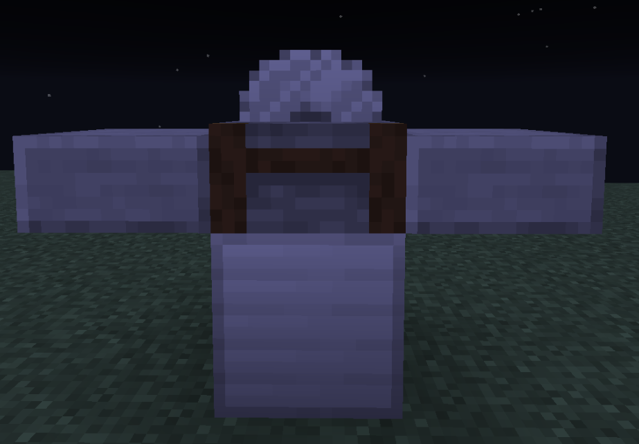

### XIV-搅拌机

搅拌机是粘液科技的基础机器之一，它可以用来获得泥土、下界岩、灵魂沙和下界疣。这使你能在游戏早期获得下界的物品

（暂无更多）

### XV-动淘金机

自动淘金机是粘液科技重要的基础机器之一，它是淘金盘与下界淘金盘的自动化版本

### 建造

自动淘金机是一个多方块结构，它由一个炼药锅与一个活板门组成，活板门可以是任何木材类型

（注：使用诡异木与绯红木制成的活版门可能会导致Bug发生，故不推荐）

将活板门放置于炼药锅上方即可

一个正确的建造方式如下图

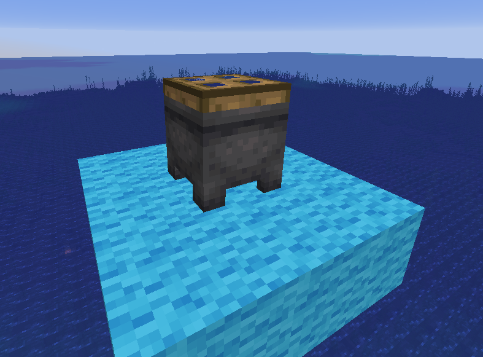

### 使用方式

手持需要转换的物品右击活板门，稍等片刻即可

